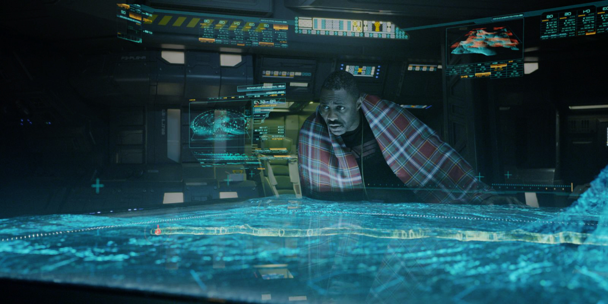

# Navigation and Mapping

Kevin J. Walchko, Phd

---

1. [Euler and Quaternion Rotations](euler-quaternion/euler-quaternion.ipynb)
1. Filters
    1. [Mahony](filters/ahrs/mahony.ipynb)
    1. [Madgwick](filters/ahrs/madgwick.ipynb)
    1. [Extended Kalman Filter](filters/ins-equations/ins-equations.ipynb)
1. Calibrations
    1. Accelerometers
    1. Magnetomgeters
    1. Gyroscopes
1. Sensors
    1. [BNO055 9DOF IMU](sensors/bno055/bno055.ipynb)
    1. BNO085
    1. [Pressure Sensors](sensors/pressure-sensor/pressure-sensor.ipynb)
    1. [GPS](sensors/gps/gps.ipynb)
1. Video Odometry
    1. [Mono Video Odometry](video-odometry/mono-odometry/mono-odometry.ipynb)
    1. [Stereo Video Odometry](video-odometry/stereo-odometry/stereo-odometry.ipynb)
    1. [KITTI Dataset](video-odometry/kitti/kitti.ipynb)
1. Path Planning
    1. [A-Star](a-star/a-star.ipynb)

-----------

 This work is licensed under a <a rel="license" href="http://creativecommons.org/licenses/by-sa/4.0/">Creative Commons Attribution-ShareAlike 4.0 International License</a>.